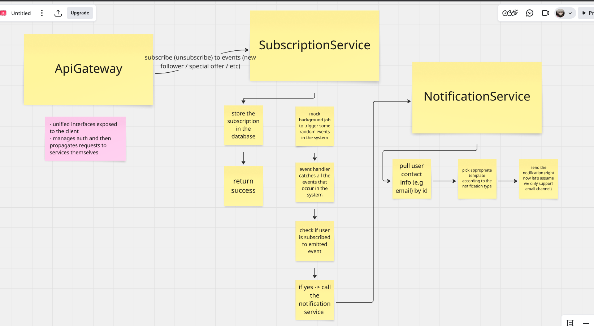

# Notiffly

Subscription-based notification system

### Architecture

- *ApiGateway* - unified interface exposed to the client, manages auth and then propagates the request to services themselves
- *Subscription Service* - responsible for managing subscriptions (subscribe / unsubscribe), catches events that happen in the system (right now it's a simple cron job that produces random events) and calls notification service if user has an active subscription
- *Notification Service* - contains all the necessary information to send a notification (e.g user's email address) along with appropriate templates. Right now only supports email sending

